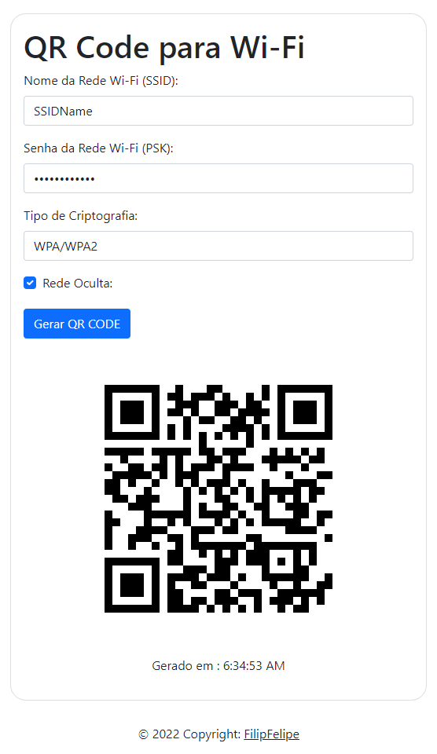

# Wi-Fi QR Code

Create a Wi-Fi QR Code 

## Features

- Create a Wi-Fi QR Code
- Wi-Fi encryption type i.e. WPA, WEP, or no encryption.
- Connect to a hidden wireless network

## Demo

https://filipfelipe.github.io/qrcode-Wifi

## Screenshots

## License

[MIT](https://choosealicense.com/licenses/mit/)

## Feedback

If you have any feedback, please reach out to us at filipfelipe@outlok.com

